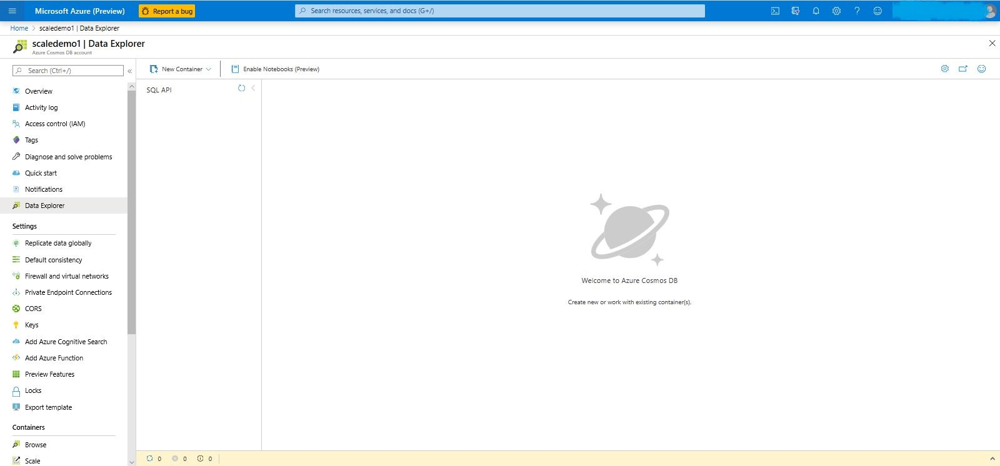
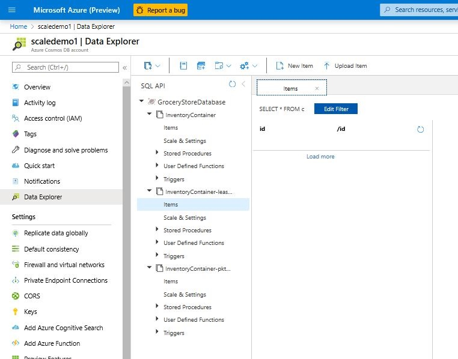
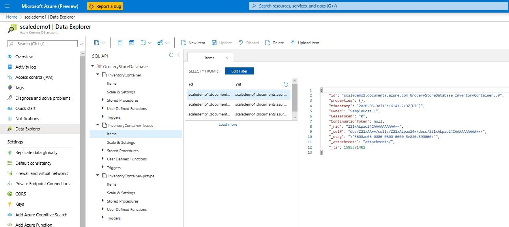
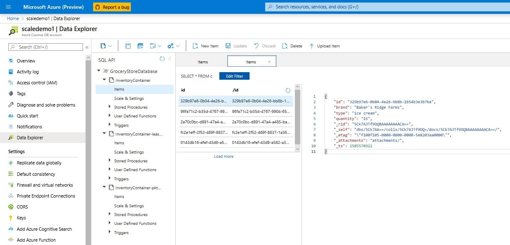
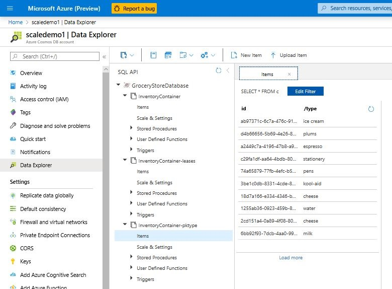
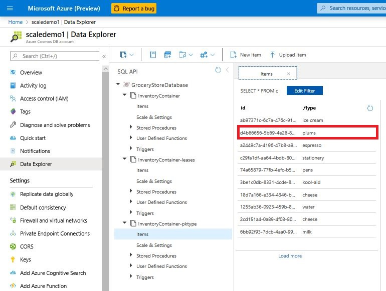

# Quickstart: an end-to-end application example with Change Feed

This Quickstart walks you through a simple example application which inserts documents into an Azure Cosmos DB container, while maintaining a materialized view of the container using Change Feed.

## Prerequisites

* Personal computer

* The URI and key for your Azure Cosmos DB account

* Maven

* Java 8

## Background

The Azure Cosmos DB Change Feed provides an event-driven interface to trigger actions in response to document insertion. This has many uses. For example in applications which are both read and write heavy, a chief use of Change Feed is to create a real-time **materialized view** of a container as it is ingesting documents. The materialized view container will hold the same data but partitioned for efficient reads, making the application both read and write efficient.

The work of managing Change Feed events is largely taken care of by the Change Feed Processor library built into the SDK. This library is powerful enough to distribute Change Feed events among multiple workers, if that is desired. All you have to do is provide the Change Feed library a callback.

This simple example demonstrates Change Feed Processor library with a single worker creating and deleting documents from a materialized view.

## Setup

If you have not already done so, clone the app example repo:

```bash
git clone https://github.com/Azure-Samples/azure-cosmos-java-sql-app-example.git
```

> You have a choice to work through this Quickstart with Java SDK 4.0 or Java SDK 3.7.0. **If you would like to use Java SDK 3.7.0, in the terminal type ```git checkout v3```**. Otherwise, stay on the ```master``` branch, which defaults to Java SDK 4.0.

Open a terminal in the repo directory. Build the app by running

```bash
mvn clean package
```

## Walkthrough

1. As a first check, you should have an Azure Cosmos DB account. Open the **Azure Portal** in your browser, go to your Azure Cosmos DB account, and in the left pane navigate to **Data Explorer**.

    

1. Run the app in the terminal using the following command:

    ```bash
    mvn exec:java -Dexec.mainClass="com.azure.cosmos.workedappexample.SampleGroceryStore" -DACCOUNT_HOST="your-account-uri" -DACCOUNT_KEY="your-account-key" -Dexec.cleanupDaemonThreads=false
    ```

1. Press enter when you see

    ```bash
    Press enter to create the grocery store inventory system...
    ```

    then return to the Azure Portal Data Explorer in your browser. You will see a database **GroceryStoreDatabase** has been added with three empty containers: 

    * **InventoryContainer** - The inventory record for our example grocery store, partitioned on item ```id``` which is a UUID.
    * **InventoryContainer-pktype** - A materialized view of the inventory record, optimized for queries over item ```type```
    * **InventoryContainer-leases** - A leases container is always needed for Change Feed; leases track the app's progress in reading the Change Feed.


    


1. In the terminal, you should now see a prompt

    ```bash
    Press enter to start creating the materialized view...
    ```

    Press enter. Now the following block of code will execute and initialize the Change Feed processor on another thread: 

    ```java
    changeFeedProcessorInstance = getChangeFeedProcessor("SampleHost_1", feedContainer, leaseContainer);
    changeFeedProcessorInstance.start()
        .subscribeOn(Schedulers.elastic())
        .doOnSuccess(aVoid -> {
            isProcessorRunning.set(true);
        })
        .subscribe();

    while (!isProcessorRunning.get()); //Wait for Change Feed processor start
    ```

    ```"SampleHost_1"``` is the name of the Change Feed processor worker. ```changeFeedProcessorInstance.start()``` is what actually starts the Change Feed processor.

    Return to the Azure Portal Data Explorer in your browser. Under the **InventoryContainer-leases** container, click **items** to see its contents. You will see that Change Feed Processor has populated the lease container, i.e. the processor has assigned the ```SampleHost_1``` worker a lease on some partitions of the **InventoryContainer**.

    

1. Press enter again in the terminal. This will trigger 10 documents to be inserted into **InventoryContainer**. Each document insertion appears in the Change Feed as JSON; the following callback code handles these events by mirroring the JSON documents into a materialized view:

    ```java
    public static ChangeFeedProcessor getChangeFeedProcessor(String hostName, CosmosAsyncContainer feedContainer, CosmosAsyncContainer leaseContainer) {
        ChangeFeedProcessorOptions cfOptions = new ChangeFeedProcessorOptions();
        cfOptions.setFeedPollDelay(Duration.ofMillis(100));
        cfOptions.setStartFromBeginning(true);
        return ChangeFeedProcessor.changeFeedProcessorBuilder()
            .setOptions(cfOptions)
            .setHostName(hostName)
            .setFeedContainer(feedContainer)
            .setLeaseContainer(leaseContainer)
            .setHandleChanges((List<JsonNode> docs) -> {
                for (JsonNode document : docs) {
                        //Duplicate each document update from the feed container into the materialized view container
                        updateInventoryTypeMaterializedView(document);
                }

            })
            .build();
    }

    private static void updateInventoryTypeMaterializedView(JsonNode document) {
        typeContainer.upsertItem(document).subscribe();
    }
    ```

1. Allow the code to run 5-10sec. Then return to the Azure Portal Data Explorer and navigate to **InventoryContainer > items**. You should see that items are being inserted into the inventory container; note the partition key (```id```).

    

1. Now, in Data Explorer navigate to **InventoryContainer-pktype > items**. This is the materialized view - the items in this container mirror **InventoryContainer** because they were inserted programmatically by Change Feed. Note the partition key (```type```). So this materialized view is optimized for queries filtering over ```type```, which would be inefficient on **InventoryContainer** because it is partitioned on ```id```.

    

1. We're going to delete an document from both **InventoryContainer** and **InventoryContainer-pktype** using just a single ```upsertItem()``` call. First, take a look at Azure Portal Data Explorer. We'll delete the document for which ```/type == "plums"```; it is encircled in red below

    

    Hit enter again to call the function ```deleteDocument()``` in the example code. This function, shown below, upserts a new version of the document with ```/ttl == 5```, which sets document Time-To-Live (TTL) to 5sec. The Change Feed ```feedPollDelay``` is set to 100ms; therefore, Change Feed responds to this update almost instantly and calls ```updateInventoryTypeMaterializedView()``` shown above. That last function call will upsert the new document with TTL of 5sec into **InventoryContainer-pktype**.

    The effect is that after about 5 seconds, the document will expire and be deleted from both containers.

    This procedure is necessary because Change Feed only issues events on item insertion or update, not on item deletion.

1. Press enter one more time to close the program and clean up its resources.